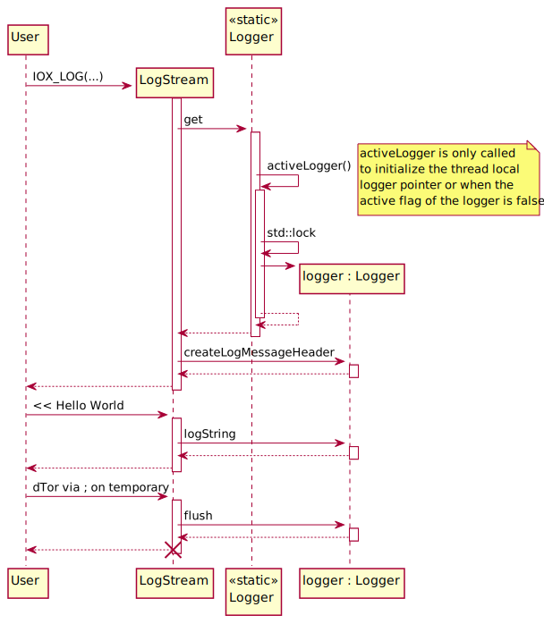
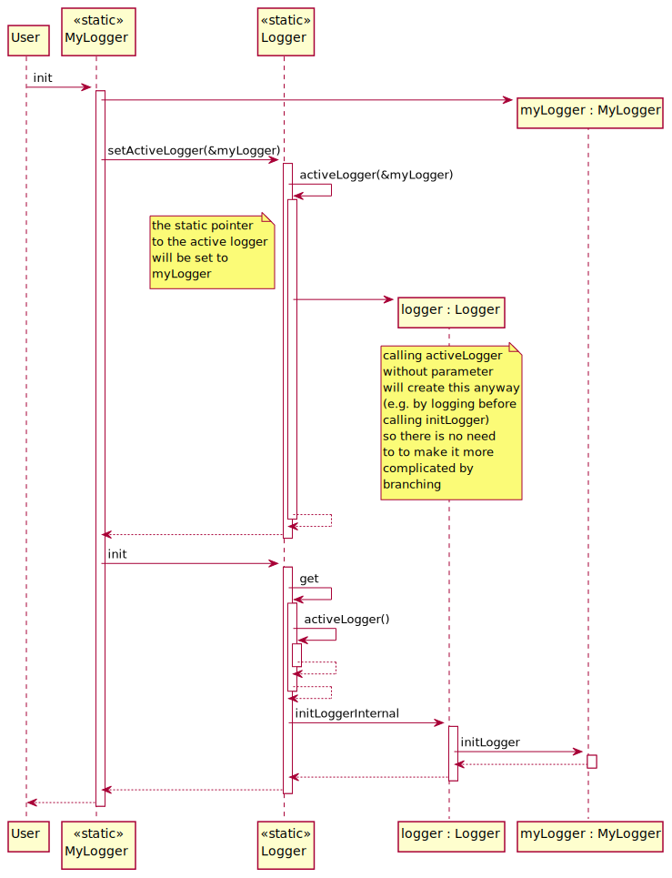
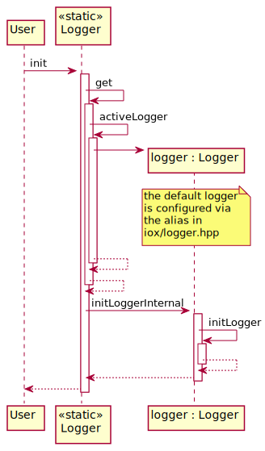
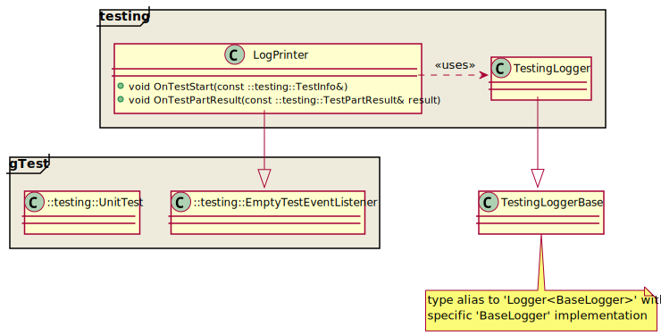
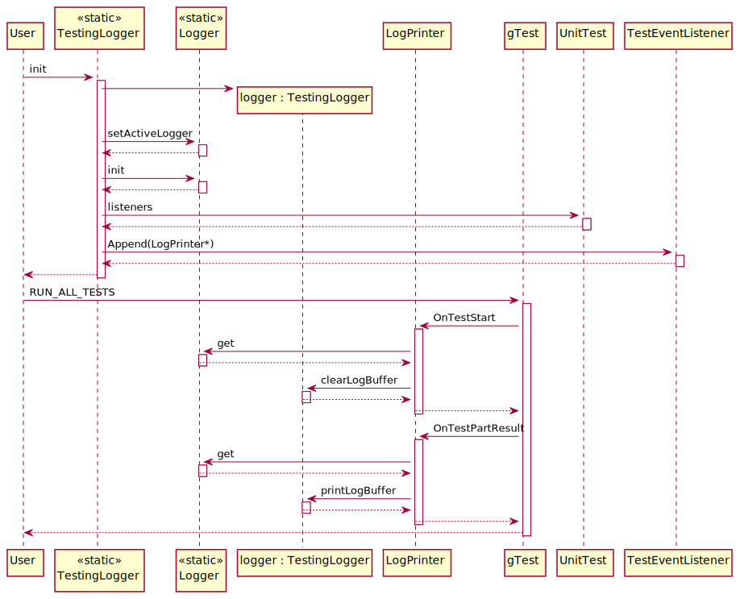

# Logging

## Summary and problem description

Logging is a crucial part of a framework since it informs the developer and
user of the framework about anomalies and helps with debugging by providing
contextual information.

Additionally, when integrated into a separate framework, the log messages should
be forwarded in order to have a single logging infrastructure.

The logging should also be performant and not allocate memory. Ideally, it should
be possible to disable it at compile time and let the compiler optimize it away.

It should also be possible to alter the behavior of the logging via environment
variables, e.g. the log level.

## Terminology

### Log levels and how to use them

| LogLevel | Usage |
|----------|-------|
| FATAL    | For fatal and non-recoverable errors which essentially lead to termination of the program. |
| ERROR    | For severe but recoverable errors. |
| WARN     | For cases when something unintentional happens which is not considered a severe error. |
| INFO     | For important status information a user should be aware of. |
| DEBUG    | Anything that is helpful for debugging. |
| TRACE    | Any comment could be replaced by logging call with log level trace. |

The log levels `FATAL`, `ERROR` and `WARN` should not be used independently but
in combination with the error handler.

## Design

### Considerations

1. Similar to other iceoryx constructs, heap usage, exceptions and recursive
   calls are forbidden. This also means that `std::string` and
   `std::stringstream` cannot be used.

2. Since the logger shall be used by the `iceoryx_hoofs` itself, the base
   implementation can also not make use of functionality in e.g. `iox::cxx` or
   `iox::posix`

3. To have a minimal runtime overhead, string formatting shall only happen when
   the log level is above the output threshold. This lazy evaluation shall also
   apply to other potentially expensive operations like the execution of a
   function call.

4. Additionally, the minimal log level shall be configurable by a compile time
   switch and everything below this log level should be compiled to no-ops. With
   this, developer can make excessive use of the most verbose log level and
   disable it by default. When debugging, this can be turned on and help to find
   the root of the problem.

5. There shall also be the possibility to alter the behavior of the logger via
   environment variables. This can be functionality like setting the log level or
   deciding whether the timestamps or file names shall be part of a log message.

6. Since iceoryx is often used as transport layer in a higher level framework, it
   shall be possible to replace the default logger at runtime and delegate the
   log messages to the logger of such a framework. To prevent misuse, this can
   only be done during the initialization phase. Afterwards an error message shall
   be logged in the new and old logger and the error handler shall be called with
   a moderate error level.

7. The default logger shall be replaceable via the platform abstraction in order
   to use the dedicated logger for log messages which are emitted before it could
   be replaced at runtime, e.g. from global objects before `main`.

8. Additionally, there shall be a compile time option to forward all log messages
   independent of the log level threshold for cases where the logger framework
   does the filtering itself.

9. For tests, the default logger shall be replaced to suppress the log messages in
   passed tests but output them for failed tests. This keeps the noise low but
   still provides useful information when needed. Additionally, there shall be an
   environment variable to circumvent the suppression when desired.

### Solution

#### Class diagram


The logger can be customized at compile time and at runtime. The former is done
by the `BaseLogger` template parameter and the latter by deriving from the logger.

#### Logging with LogStream



#### Logging macro

The `IOX_LOG` macro is intended for general use. It has one parameter which
sets the log level and delegates `file`, `line` and `function` to the `IOX_LOG_INTERNAL`
macro. The latter can be used in places like a custom `ASSERT` macro which already
obtained the `file`, `line` and `function` parameter.

The `IOX_LOG_INTERNAL` uses the `iox::log::internal::SelectedLogStream` struct which is
specialized for `LogLevel::OFF` to compile to a no-op when the logging data does not
cause side effects. `IOX_LOG(INFO) << 42;` won't cause side effects but
`IOX_LOG(INFO) << functionCall();` might have some.

The `IOX_LOG_INTERNAL` calls `self()` on the `LogStream` instance to create an lvalue
reference to the `LogStream` instance. This eases the implementation of logging
support for custom types since `IOX_LOG(INFO) << myType;` would require to implement
an overload with a rvalue `LogStream` reference but `IOX_LOG(INFO) << "#### " << myType;`
requires a lvalue reference.

#### Behavior before calling Logger::init

In order to have log messages before `Logger::init` is called, the default logger
is used with `LogLevel::INFO`. It is up to the implementation of the default
logger what to do with these messages. For iceoryx the default logger is the
`ConsoleLogger` (this can be changed via the platform abstraction) which will
print the log messages to the console.

Although, it is possible to use the logger without calling `Logger::init`, this is
not recommended. This behaviour is only intended to catch important log messages
from pre-main logger calls.

#### Replacing the logger at runtime

The default console logger can be replaced at runtime to a custom logger which
can be used to forward the log messages to a logger of another framework.

This is done by deriving from the base `Logger` class and implementing the pure
virtual `createLogMessageHeader` and `flush` methods. Finally, the derived logger
must be activated by calling the static `Logger::activeLogger` function and
passing the new logger as argument to the function. The logger must have a static
lifetime and should therefore be placed in the data segment.

The call to `iox::log::Logger::init` will finalize the option to replace the logger
at runtime. Further efforts to replace the logger will call the error handler
with a `MODERATE` error level and a log message to the old and new logger.

See also the code example to [create a custom logger](#creating-a-custom-logger).



#### Replacing the default logger for a platform

Each platform must specify the following aliases in the `platform_settings.hpp`
header.

```cpp
using LogLevel = pbb::LogLevel;
using pbb::asStringLiteral;
using pbb::logLevelFromEnvOr;

using Logger = pbb::Logger<pbb::ConsoleLogger>;
using TestingLoggerBase = pbb::Logger<pbb::ConsoleLogger>;
```

With `LogLevel` enum being the log level enum with the values defined in the
[class diagram](#class-diagram). The `Logger` must be a class specifying the
interface from the class diagram. It is recommended to provide a custom
implementation via the template parameter instead of implementing everything
from scratch. The `pbb::ConsoleLogger` is an example of such an implementation
and can also be a base for customization.

The `BaseLogger` part of the logger must fulfil the following interface

```cpp
public:
  static LogLevel getLogLevel();
  void setLogLevel(LogLevel logLevel);
protected:
  virtual void initLogger(LogLevel logLevel);
  virtual void createLogMessageHeader(const char* file, const int line, const char* function, LogLevel logLevel);
  virtual void flush();
  std::tuple<const char*, uint64_t> getLogBuffer() const;
  void assumeFlushed();
  void LogString(const char* message);
  void logI64Dec(const int64_t value);
  void logU64Dec(const uint64_t value);
  void logU64Hex(const uint64_t value);
  void logU64Oct(const uint64_t value);
  void logBool(const bool value);
  void logFloat(const float value);
  void logDouble(const double value);
  void logLongDouble(const long double value);
```

Tests should be silent and not flood the console with expected error messages.
`TestingLoggerBase` will be used as base class for the testing logger to suppress
the output for passed tests. This class must also be derived from `Logger` in
order to replace the logger at runtime.



#### Dedicated logger for testing

In order to have quiet tests, the logging output shall be suppressed for passed
tests and printed to the console for failed tests.

For this purpose a `TestingLogger` shall be supplied and initialized right after
`::testing::InitGoogleTest(&argc, argv)` and before `RUN_ALL_TESTS()`

This are the classes involved in the testing setup:



This is the sequence diagram of the setup of the testing logger:



#### Environment variables

The behavior of the logger can be altered via environment variables and the
`Logger::init` function. Calling this function without arguments, it will check
whether the environment variable `IOX_LOG_LEVEL` is set and use that value or
`LogLevel::INFO` if the environment variable is not set. To have a different
fallback log level, the `logLevelFromEnvOr` function can be used, e.g.

```cpp
iox::log::Logger::init(iox::log::logLevelFromEnvOr(iox::log::LogLevel::DEBUG));
```

If the logger shall not be altered via environment variables, `Logger::init` must
be called with the fitting log level.

For the `TestingLogger` there is an additional environment variable called
`IOX_TESTING_ALLOW_LOG`. This enables the printing of the log messages for all
tests instead of only for failed ones.

| Environment variable | Allowed values |
|--------------|-----------|
| IOX_LOG_LEVEL | off, fatal, error, warn, info, debug, trace |
| IOX_TESTING_ALLOW_LOG | on, off |

#### Thread local storage

The `Logger` base class is using thread local storage to provide a buffer for
each thread. In case thread local storage is not desired, the logger must be
re-implemented via the platform abstraction.

### Code example

#### Using the default console logger

```cpp
#include "iceoryx_hoofs/log/logging.hpp"

int main()
{
    iox::log::Logger::init(iox::log::logLevelFromEnvOr(iox::log::LogLevel::DEBUG));

    IOX_LOG(DEBUG) << "Hello World";

    return 0;
}
```

#### Add logging support for custom types

```cpp
#include "iceoryx_hoofs/log/logging.hpp"
#include "iceoryx_hoofs/log/logstream.hpp"
#include <cstdint>

struct MyType
{
    uint16_t a {0};
    uint16_t b {0};
};

iox::log::LogStream& operator<<(iox::log::LogStream& stream, const MyType& m)
{
    stream << "MyType { a = " << m.a << "; b = " << m.b << " }";
    return stream;
}

int main()
{
    MyType m;
    IOX_LOG(INFO) << m;

    return 0;
}
```

#### Creating a custom logger

This is a simple custom logger which prints the log level as emoji and ignores
the file, line number and function name.

```cpp
#include "iceoryx_hoofs/log/logger.hpp"
#include "iceoryx_hoofs/log/logging.hpp"

class MyLogger : public iox::log::Logger
{
  public:
    static void init()
    {
        static MyLogger myLogger;
        iox::log::setActiveLogger(&myLogger);
        iox::log::Logger::init(iox::log::logLevelFromEnvOr(iox::log::LogLevel::INFO));
    }

  private:
    void createLogMessageHeader(
        const char* file IOX_MAYBE_UNUSED,
        const int line IOX_MAYBE_UNUSED,
        const char* function IOX_MAYBE_UNUSED,
        iox::log::LogLevel logLevel) override
    {
        switch(logLevel) {
            case iox::log::LogLevel::FATAL:
                logString("💀: ");
                break;
            case iox::log::LogLevel::ERROR:
                logString("🙈: ");
                break;
            case iox::log::LogLevel::WARN:
                logString("🙀: ");
                break;
            case iox::log::LogLevel::INFO:
                logString("💘: ");
                break;
            case iox::log::LogLevel::DEBUG:
                logString("🐞: ");
                break;
            case iox::log::LogLevel::TRACE:
                logString("🐾: ");
                break;
            default:
                logString("🐔: ");
        }
    }

    void flush() override {
        puts(iox::log::Logger::buffer());
        iox::log::Logger::assumePushed();
    }
};

int main()
{
    MyLogger::init();

    IOX_LOG(FATAL) << "Whoops ... look, over there is a dead seagull flying!";
    IOX_LOG(ERROR) << "Oh no!";
    IOX_LOG(WARN) << "It didn't happen!";
    IOX_LOG(INFO) << "All glory to the hypnotoad!";
    IOX_LOG(DEBUG) << "I didn't do it!";
    IOX_LOG(TRACE) << "Row row row your boat!";

    return 0;
}
```

## Open issues

### Lazy evaluation

Lazy evaluation via the following macro clashes with static code analyzer which
will generate warnings due to missing braces of the if-statement.

```cpp
#define LAZY() if (cond)

LAZY() expensiveFunctionCall();
```

Lazy evaluation with stream based logging seems to be challenging. An alternative
might be a variadic macro like `IOX_LOG(INFO, "Hello World");`

### Miscellaneous

- do we need to change the log level after `Logger::init`
- do we want a `IOX_LOG_IF(cond, level)` macro
- shall the TestingLogger register signals to catch SIGTERM, etc. and print the
  log messages when the signal is raised? It might be necessary to wait for the
  error handling refactoring before this can be done
- instead of having the `Logger::init()` static function with hidden default
  parameter this could be replaced by `Logger::init(LogLevel::WARN)`,
  `Logger::initFromEnvOr(LogLevel::WARN)` and a builder like
  `Logger::customize().logLevelFromEnvOr(LogLevel::WARN).init()`
- wrap `__FILE__`, `__LINE__` and `__FUNCTION__` into a `source_location` struct
  - where should this struct be placed
  - could also be used by `Expects`, `Ensures`
